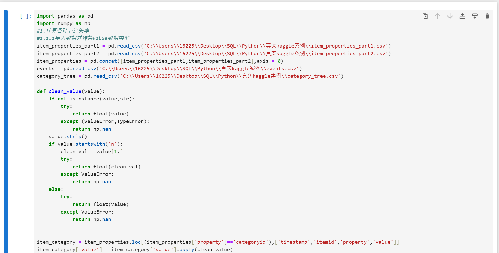
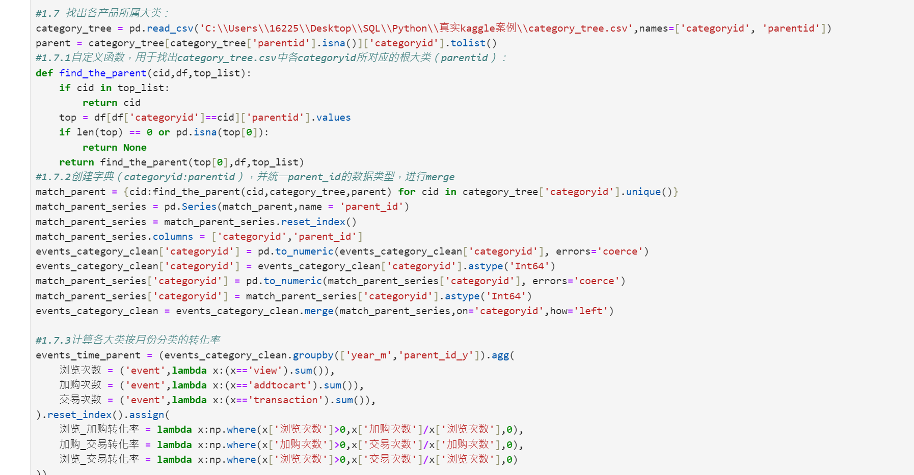
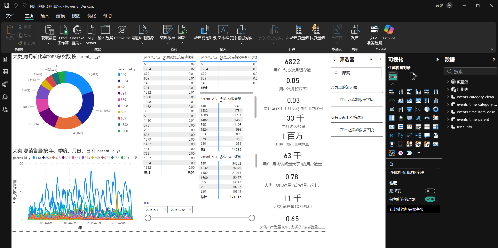

# RR-E-commerce-Dataset-Analysis
电商平台数据集相关分析
# 数据来源

本项目使用 RetailRocket E-commerce Dataset，原始数据需从 Kaggle 下载。

下载链接：https://www.kaggle.com/datasets/retailrocket/ecommerce-dataset

# 电商用户行为与品类转化率分析

## 1 项目概述
本项目基于 RetailRocket 真实电商数据集（275万条行为记录，140万独立访客），通过 Python 进行数据清洗与指标计算，并使用 Power BI 搭建分析仪表板，并提出可落地的运营优化建议。

## 2 分析结论摘要
### 2.1 产品层面
#### 2.1.1 销售量
以数据集中的5个月数据统计得出，总销售量前5的大类分别是140、1532、1600、1482以及395，这5类的商品总产品数占全部大类总产品数的65%，但销售量却占到总销售量的78%，这种情况在该数据集所覆盖的5个月中均为如此，可见TOP5产品用较少的产品数实现了更高的成交量。
#### 2.1.2 转化率
浏览_交易转化率方面，产品大类id为140和1224的两个大类每个月均位于全部大类转化率的TOP5，是转化率稳定高位的重点产品大类，1224更是每月都位于TOP2水平。679和791在数据集涵盖的5个月中亦分别有4个月和3个月位于大类转化率TOP5中。

### 2.2 用户层面
#### 2.2.1 访问量
用户访问量在7月达到峰值（约62万次访问），可见销售旺季在7月附近。
#### 2.2.2 留存率
用户的次月留存率较低（3-5%左右）。
#### 2.2.3 进一步分析
次月留存的用户中上月交易过的比例在2-3%左右。

## 3 优化建议
### 3.1 产品层面
#### 3.1.1 
继续保持并扩充支柱大类的产品矩阵，稳住基本盘业务。其他大类虽然销量或转化率较低，但考虑到对应产品数量同样较少，若该产品大类为新开发大类，则考虑继续扩充产品矩阵及优化广告投放（文案，推送用户类型等）；若该大类为准淘汰类型，则可通过降价促销、加送赠品或优惠券等形式促进清货。
#### 3.1.2 
针对浏览至交易完成的转化率较低问题，考虑广告投放是否科学高效（文案是否与实际产品存在较大差异、推送的用户类型是否为该产品的潜在用户等）、产品定价是否合理或者该产品与平台优惠政策是否冲突、相比于本平台，其他竞对平台的产品在定价或优惠措施方面是否比本平台更优导致用户流失至竞对平台的转化率下降。
### 3.2  用户层面
#### 3.2.1 
针对销售旺季（如7月份），平台可进行促销活动进一步拉升业绩，活动政策偏向于利用自身明星产品拉动非热门产品销售，并通过广告投放或优惠券发放等形式引流，提高访客数量，增加交易频率。
#### 3.2.2 
结合各产品类别从浏览到产生交易过程中的转化率（1-2%左右）来看，用户次月留存率低可能是因为通过广告等方式引流至商品页面的大多数用户认为广告与实际产品呈现产生了一定落差，导致交易失败和用户流失。对此，首先考虑广告推送文案及推送逻辑优化（文案更贴合产品实际、根据用户类型及购买记录进行更精准的推送）；其次观察竞对的活动节奏主动进行活动对抗，将用户拉回至自己手中，减少用户流失率，提高次月留存率。
#### 3.2.3 
可考虑通过用户购买记录中的产品推算该用户的其他潜在产品需求，推送对应品类广告或对应产品优惠券吸引用户继续购买本平台其他产品，提高本月交易过的用户在次月再次浏览或产生交易的概率。

## 4 数据处理关键点提要
#### 4.1 哈希属性解析
编写自定义函数，统一解析数据集中以 `n` 为前缀的数值型属性（如品类id）。
#### 4.2 动态类目快照
针对商品类目会随时间调整的问题，采用 `pandas.merge_asof()` 方法，按事件时间戳精准匹配当时的商品所属类目，确保归因准确。
#### 4.3 层级类目构建
编写递归算法处理 `category_tree.csv`，将数千个底层类目映射至 23 个一级产品大类，实现分层转化分析。

# 附：项目文件结构

├── README.md # 当前正在阅读的文档
├── notebooks/
│ ├── 数据集清洗及分析.ipynb # 数据清洗、格式转换与脱敏处理
├── PBI/
│ └── PBI可视化分析展示.pbix # 交互式分析仪表板
└── images/ # python代码部分截图与PBI可视化呈现截图

# 如何复现
#### 1. 获取数据
从 [Kaggle RetailRocket Dataset](https://www.kaggle.com/datasets/retailrocket/ecommerce-dataset) 下载四个 CSV 文件。
#### 2. 安装依赖
`pip install pandas numpy
#### 3. 运行分析
执行 `notebooks/` 下的 `数据集清洗及分析.ipynb` 文件。
#### 4. 查看仪表板
用 Power BI Desktop 打开 `PBI/` 中的 `PBI可视化分析展示.pbix` 文件即可。

# 部分截图

